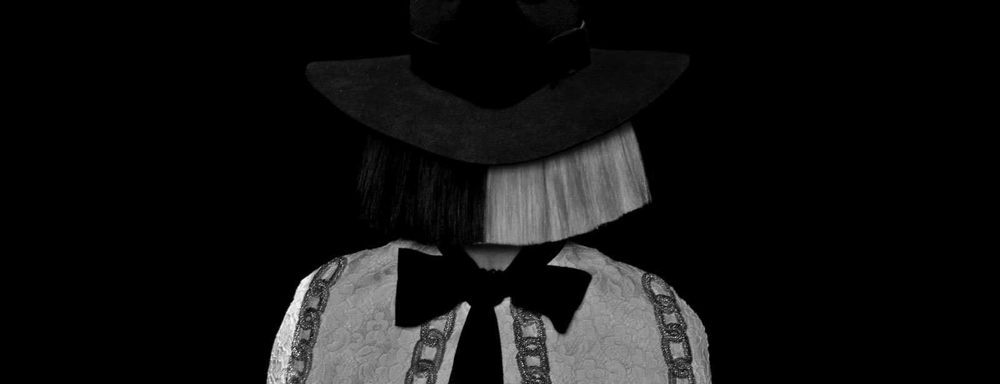

# NAGARJUNA VISWANATH 

## NAGARJUNA

My name is nagarjuna. 
I am from guntur. 
i am studying b tech 
My hobby is to listen music

| Year of Graduation | Degree        | Institution                        |
| ------------------ | ------------- | ---------------------------------- |
| 2024               | B.tech        | Indian Institute of Technology Goa |
| 2021               | 12th Standard | srichaithanya                      |
| 2019               | 10th Standard | wisewoods                          |

*
## First Year Courses @IIT Goa

### AUTMN

- CS101: Introduction to Computing by *Dr. Clint P. George*
  *MTH101 Calculus by *Dr. Sandipan De*
- PH101 Relative and Quantum Mechanics by *Dr. Santosh Kumar Das*
- CH101 Quantum Chemistry by Dr. E. Siva *Subramaniam Iyer*
- CH102  Inorganic and Organic Chemistry by Dr. Raja Mitra 
- MC 100 by various teachers
- CH104Chemistry Lab Course by *Dr. E. Siva Subramaniam Iyer*

cs101 link for atumn semester  [cs101]((https://clintpgeorge.github.io/cs-101/autumn-2021/)

### Spring 2022 

1. CS102 Software Tools by <u> Dr. Clint P. George           </u>
2. MTH1021 Linear Algebra by <u> Dr. Kalpesh Haria </u>
3. PH102 Electricity and Magnetism by <u> Dr. Vaibhav Wasnik </u>
4. BIO101 Introduction to Biology by <u> Dr. Sreenath  </u>
5. EE101 intro to circuts<u> Dr. Nandakumar Nambath </u>

cs102 link for spring semester  [cs102](https://clintpgeorge.github.io/cs-102/spring-2022/)

## Extra Curricular Activities
games
music
reading books
